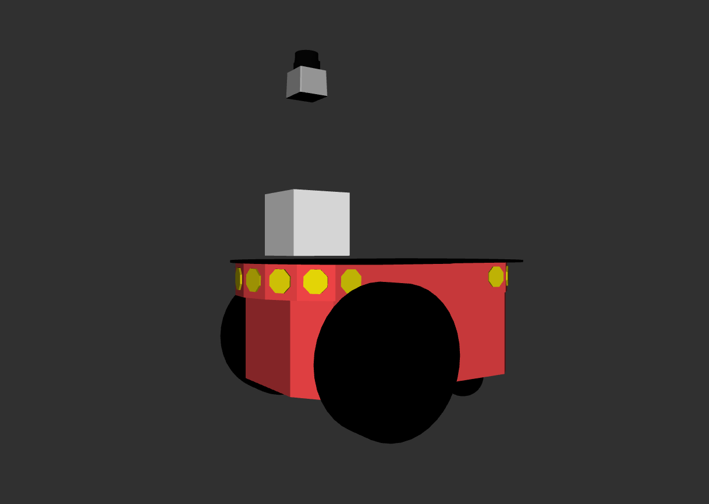
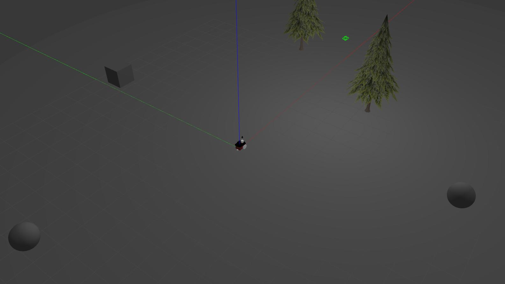

# Requerimientos
Esta libreria se probó en ROS Melodic.
```sh
$sudo apt-get install ros-$ROS_DISTRO-gazebo11-ros-pkgs  ros-$ROS_DISTRO-gazebo11-ros-control 
$sudo apt-get install ros-$ROS_DISTRO-joint-state-publisher ros-$ROS_DISTRO-robot-state-publisher
```
# Libreria Pioneer2dx
Esta libreria contiene al Pioneer2dx  

Además cuenta con el siguiente entorno de testeo


Papra probarlo setear las variables de entorno de ROS y luego hacer

```sh
$ mkdir ws/src
$ cd ws/src
$ git clone https://github.com/Seba-san/pioneer2dx.git
$ git checkout package
$ cd ..
$ catkin_make
$ source devel/setup.bash
$ roslaunch pioneer2dx display_camera.launch
```
Este comando iniciará gazebo server sin la interfaz gráfica, iniciara el mundo test_word.sdf y pone el pioneer2dx en el origen de coordenadas.
En otra terminal poner
```sh
$ roscd pioneer2dx
$rosrun rviz rviz -d ./config/rviz_config.rviz
```

Pioneer2dx cuenta con una cámara  frontal 800x600px publicando las imagenes a 15 frames. Todo esto es configurable en el archivo plugins/camera_plug.xacro


License
----

MIT
